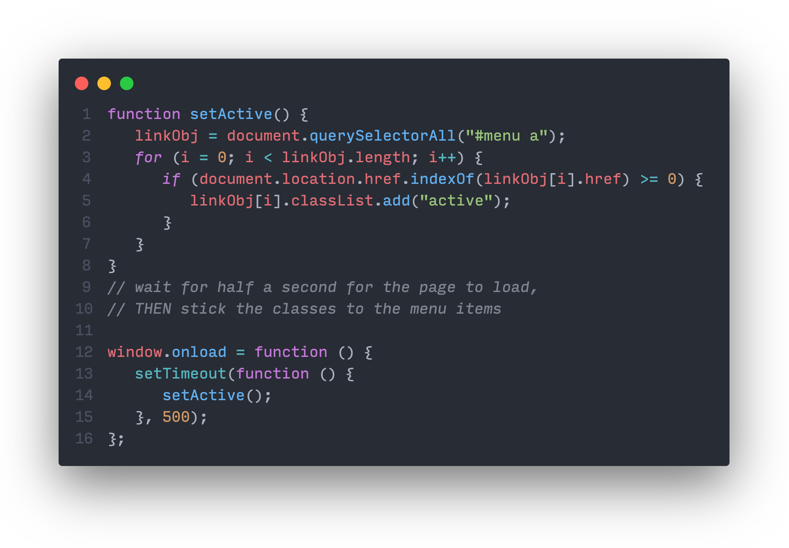

# Html includes with standard javascript

Play live with this code in **Plunker** > [click here!](https://embed.plnkr.co/github/davidvandenbor/html-includes-with-standard-javascript)

An example of how you can include "snippets" of HTML into other HTML pages. This might come in handy for things like including headers, footers, menu's or sidebars to multiple pages of a website or application. For instance, you can embed a **snippet of code** into 20 or 30 webpages simultaniously: a **single top bar navigation menu** which was saved as a reusable piece of code in a seperate text or HTML file. It takes just a couple of lines of javascript to do this.

As a bonus, I've also added a few lines of code that sticks an ".active" css class on the menu item (with the name of the currently loaded page). It does this by checking the URL that's actively present in the address bar of your browser, and then [looping](https://www.w3schools.com/js/js_loop_for.asp) over the menu items to see if it matches the name of the menu link.

## See it in action

See a working version online that you can download (ZIP) or edit live in **Plunker**:
https://embed.plnkr.co/github/davidvandenbor/html-includes-with-standard-javascript
